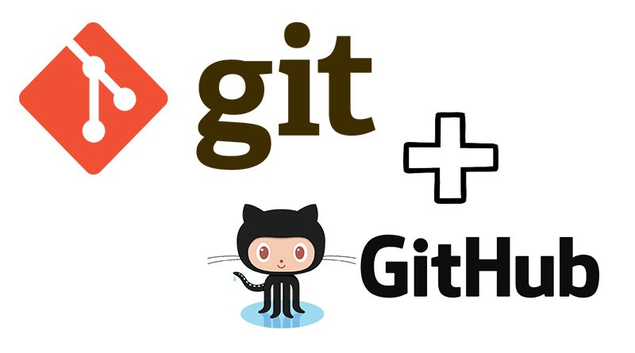

_This is a coursework on git taught by Udacity_

# Git Tutorial

This repo contains a list of useful git commands as taught by the free online Udacity [course](https://www.udacity.com/course/version-control-with-git--ud123).

<p align="center"></p>

## Version Control

### Terminology

A dictionary of terms can be found [here](ud123-git-keyterms.pdf).

**Source code manager (SCM)**
> Git is a or version control system (VCS) which means a tool that manages different versions of source code. Git can be downloaded from [here]( https://git-scm.com/).

**Commit**
> saves your project's files and any information about them

**Repository**
> directory which contains project work as well as hidden files which are used to communicate with Git.

**Working Directory**
> The files visible in my computer's file system or where .git file is placed. Different from the concept of *current working directory*. 

**Checkout**
> when the content in the repository has been copied to the Working Directory.

**Staging Area/Index**
> A file in the Git directory that stores information about what will go into the next commit. Files on the Staging Index are poised to be added to the repository.

**SHA** 
> is an ID number for each commit, it is a 40-character string composed of characters and stands for "Secure Hash Algorithm". 

**Branch** 
> A new line of development that diverges from the main line of development. This line of development can continue without altering the main line. 

## Configuring Git

Git can be configured by using the `git config` command.

For example:

```
# sets up Git with name and email
git config --global user.name "<Your-Full-Name>"

git config --global user.email "<your-email-address>"

```

## Creating a Repo

Use `git init` to **create a new, empty repo in the current directory**. Git does this by adding a .git directory which contains files to keep track of everything.  

### Cloning a Repo

Use `git clone` to **create an identical copy of an existing repository**. 

```
git clone <path-to-repository-to-clone> <optional-name-of-directory>
```

## Checking status of Repo/Review changes

The `git status` command **displays which files have been changed/added in directory** that is different from the repo.

- Use the git status command after any other command to understand how Git works


The `git log` command **shows the commits submitted into the repo**.

- git log prints the list of commits using the `less` command in shell. Use spacebar to scroll one page down, `b` to scroll one page up, and `q` to quit.

- One option is to use the **`git log --oneline`** to display each commit as one line with just the first letters of the SHA and the commit message.

- `git log --stat` shows the files that have been changed in the commit as well as the number of lines that have been added or deleted. 

- `git log -p` can be used to display the actual changes (locations and codes) made to a file.


The `git show` command will only **show the latest or one commit (if SHA is provided)**. The output is the same as the `git log -p` command. 

- `git show` can add the `--stat` , `-p`, and `-w` flags to show number of files changed, difference with old file, and to ignore changes to whitespace.

## Adding files to the Stage Index

The `git add <file1> <file2>` command **add files from the Working Directory to the staging index**. 

- Use **`git add .`** to stage everything in the the current directory. The period refers to the current directory including all nested files and directories.

## Making commits

The `git commit` command **take file from the staging index and save them in the repository**. 

- **The goal is that each commit has a single focus**. Each commit should record a single-unit change. Each commit should make a change to just one aspect of the project. A commit shouldn't include unrelated changes. That way, if it turns out that one change had a bug and we had to undo it, we don't have to undo the other change too. 

- `git commit` will open the code editor to prompt for a commit message if the `-m` flag is not used.

- When adding commit messages, explain what the commit does but do not explain why or how the changes are made!. Do not use the word and, if you have to use "and" break the changes into separate commits. Be consistent in how you write commit messages!

`git diff` **displays the changes that have been made but haven't been committed yet**. Output is similar to `git log -p` command. 

### Ignoring files

The `.gitignore` file is used to **tell Git about the files Git should not track**. Create `.gitignore` file in the same directory `.git` is in and add file names inside the `.gitignore` file to make sure that a file isn't committed to the project!

- `.gitignore` can use the concept called globbing which allows the use of special characters to match patterns. 
    - `*` matches 0 or more characters
    - `?` matches 1 character
    - `[abc]` matches a or b or c
    -  `**` matches nested directories 
    - `a/**/z` matches a/z, a/b/z, a/b/c/z

## Tagging

The `git tag` command **adds tags to specific commits**.
- Example, `git tag -a v1.0 a87984` adds a tag that specifies the commit with the a87984 SHA is version 1.
- The `-a` flag creates an annotated flag which includes extra information such as person who made the tag, date tag was made, etc.
- always use annotated tags
- Use `git log` to show which commits have tags (shown next to SHAs)
- delete tags with the `-d` flag such as `git tag -d v1.0`

## Branching and Merging

The `git branch` command **creates, deletes, or lists branches in repository**.
- `git branch` lists branches in a repository. Current branch is shown with an asterisk *.
- `git branch <branch_name>` creates a branch but doesn't switch to that new branch.
- `git branch -d <branch_name>` deletes the branch. CAN't delete the branch we are on, have to switch to another branch first.
- Git doesn't allow deletion of a branch with commits that are unique to the branch. To force delete use the `-D` flag.

The `git checkout <branch_name>` command **switches between different branches and tags**.
- Files that are in the Working Directory that Git is tracking will be removed (and stored)
- This will go into the repo and pull all the files and directories associated with that branch
- `git checkout -b <branch_name>` creates a new branch and switch to it in one command.
- Use `git log --oneline --decorate` to check the commits for the branch we are in.
- ` git log --oneline --decorate --graph -- all` to see all branches and commits in the repo. 

The `git merge`command **takes changes on different branches and combine them together**.
- `git merge <branch_name>` merges current branch into the named branch.
- Two types of merge: regular merge and fast-forward merge. 
    - Regular merge happens if the branch being merged in has less commits. 
    - Fast-forward merge happens if the branch being merged in is ahead of the current branch in commits.
- To undo merge, use `git reset --hard HEAD^`
- When merging, Git will check the branches' history and find a single commit that both branches have in the commit history. Then Git combines the lines of code that were changed on the separate branches together. Then Git makes a commit to record the merge.

### Merge conflict

A **merge conflict** will happen when the same line(s) of code are changed in separate branches. Git will not know which change to keep. Git will show the differences using the merge conflict indicators (see below). The **solution** is to edit the same line(s) on two different branches and then try to merge again.

#### Merge conflict indicators
- `<<<<<<< HEAD` everything below this line (until the next indicator) shows what's in the current branch
- `||||||| merged common ancestors` everything below this line (until the next indicator) shows what the original lines were
- `=======` is the end of the original lines, everything that follows (until the next indicator) is what's in the branch that is being merged in.
- `>>>>>>> branch_name` is the ending indicator of what's on the branch that's being merged in

#### To resolve a merge conflict:
- choose which line(s) to keep
- locate and remove all lines with indicators
- Once all lines with merge conflict indicators are removed (and the line to keep remains), save file, add to staging index, and commit.

## Undoing changes

The `git commit --amend` command **alters the most recent commit**. For e.g. if we forgot to include a file or a typo in the commit message.
- To add a forgotten link we can edit the file, save the file, stage it, and run the command `git commit --amend`. This will update the most recent commit instead of creating a new one. 
- We can also add a new commit message which will overwrite the original message. 

`git revert <SHA_of_commit_to_revert>` **reverses given commit**. For e.g. lines added in a commit are deleted. 
- This command will undo the changes made by the provided commit.
- It will also create a new commit to record the change.

`git reset <reference_to_commit>` erases commit.
- On first glance this might seem similar to revert but reverting **creates** a new commit that undos a previous commit, while resetting **erases** commit.
> Resetting is dangerous, If a commit is no longer in repository, its content is gone. We can use the `git reflog` command to access content erased in the last 30 days.
- The command can be used to 
    - move the HEAD and current branch pointer to the referenced commit
    - erase commits using the `--hard` flag
    - move committed changes to the staging index using the `--soft` flag
    - move/unstage committed changes to the Working directory using `--mixed` flag (default)
    - usually a backup branch is created before doing hard resets

### Relative Commit references
There are times when we want to reference a commit before the current commit, or two before the current commit. These special **Ancestry References** can be used:
- `^` indicates the parent commit
- `~` indicates the first parent commit

For example:
- the parent commit can be referred to as `HEAD^`, `HEAD~`, `HEAD~1`.
- the grandparent commit `HEAD^^`, `HEAD~2`.
- the great-grandparent commit `HEAD^^^`, `HEAD~3`.

For a merge commit, the `^` refers to the branch we were in when running the `git merge`, while the `^2` indicates the branch that was merged in. 